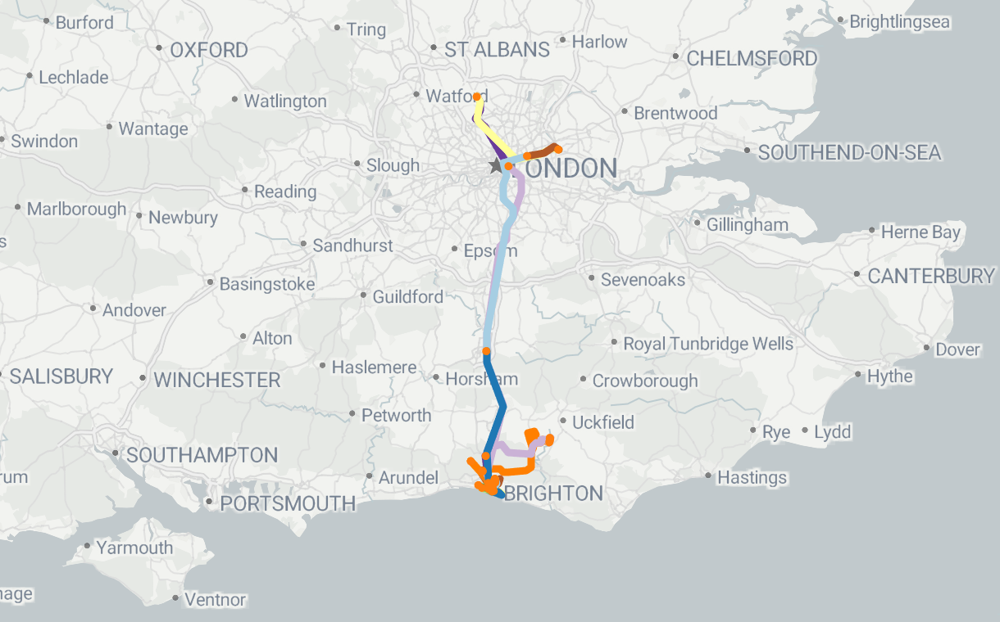

# Mobility Data Analysis

A comprehensive Python project for analyzing GPS mobility data with trip detection, transportation mode classification, and interactive visualization.

<a href="https://mobilitydataanalysis.streamlit.app/">
  
</a>

## Overview

This project processes raw GPS trajectory data from mobile devices to identify individual trips, classify transportation modes, and visualize movement patterns. It includes machine learning models for automated classification and a Streamlit-based web interface for interactive exploration.



## Features

- **Trip Detection**: Automatically identifies individual trips from continuous GPS data using temporal and spatial thresholds
- **Transportation Mode Classification**: Predicts whether trips are by car, bike, or walking using scikit-learn models
- **Data Visualization**: Interactive maps, temporal analysis, and trip statistics
- **Multi-User Support**: Process and analyze data for multiple users independently
- **Streamlit Dashboard**: Interactive web interface for exploration and analysis
- **Feature Engineering**: Extracts relevant features for machine learning (speed, acceleration, turning angles, etc.)

## Installation

1. **Clone the repository**
   ```bash
   git clone https://github.com/BreenSammy/mobility-data-analysis.git
   cd mobility-data-analysis
   ```

2. **Create a virtual environment** (recommended)
   ```bash
   python -m venv venv
   source venv/bin/activate  # On Windows: venv\Scripts\activate
   ```

3. **Install dependencies**
   ```bash
   pip install -r requirements.txt
   ```

4. **Install the package in development mode**
   ```bash
   pip install -e .
   ```

## Usage

### Interactive Dashboard

Launch the Streamlit dashboard to explore data and results:

```bash
streamlit run streamlit/app.py
```

The dashboard provides three main sections:
- **Raw Data**: Explore original GPS traces and sensor data
- **Trips**: View detected trips and trip statistics
- **ML**: Review classification results and model predictions

### Running the Classification Pipeline

Process raw data and classify trips:

```bash
python scripts/run_classification.py
```

### Data Structure

#### Raw Data Format

Input data should be organized by user and recording date:
```
data/raw/User{N}/{DDMMYY}/
  ├── 00inf.txt              # Recording metadata
  ├── Torso_Location.txt     # GPS coordinates
  ├── Torso_Motion.txt       # Acceleration data
  └── labels_track_main.txt  # Ground truth labels
```

#### Processed Data

Processed output includes:
- `trips_from_data.csv`: Detected trips with coordinates and timestamps
- `trip_times_from_data.csv`: Trip start/end times and statistics
- `trip_classification.csv`: Transportation mode predictions
